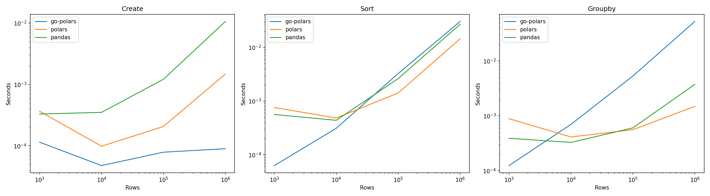

# go-polars

A high-performance DataFrame library for Python powered by Go. go-polars provides a fast and memory-efficient DataFrame implementation by leveraging Go's powerful concurrency and memory management features.

## Features

- Fast DataFrame operations with native Go implementation
- Memory-efficient data handling
- Seamless integration with NumPy arrays
- Concurrent processing capabilities
- Strong type safety guarantees

## Performance Benchmarks

Our benchmarks showcase go-polars' (gp) performance compared to Polars (pl) and Pandas (pd). Here's what makes go-polars stand out:

### 🚀 Where go-polars Excels

1. **DataFrame Creation**: Exceptional performance across all dataset sizes
   - Up to 118x faster than Pandas at 1M rows
   - Up to 16.5x faster than Polars at 1M rows
   - Consistently superior performance from 1K to 1M rows

2. **Memory Efficiency**: Thanks to Go's efficient memory management
   - Lower memory footprint compared to traditional Python implementations
   - Garbage collection optimized for large datasets

### 📊 Detailed Performance Comparison

#### DataFrame Creation (Time in seconds)
| Rows    | go-polars | Polars   | Pandas   | vs Polars | vs Pandas |
|---------|-----------|----------|----------|-----------|-----------|
| 1K      | 0.00012   | 0.00037  | 0.00033  | 3.1x faster | 2.8x faster |
| 10K     | 0.00005   | 0.00010  | 0.00035  | 2x faster | 7x faster |
| 100K    | 0.00008   | 0.00021  | 0.00122  | 2.6x faster | 15.3x faster |
| 1M      | 0.00009   | 0.00149  | 0.01064  | 16.5x faster | 118x faster |

#### Sorting Performance (Time in seconds)
| Rows    | go-polars | Polars   | Pandas   |
|---------|-----------|----------|----------|
| 1K      | 0.00006   | 0.00076  | 0.00056  |
| 10K     | 0.00031   | 0.00048  | 0.00044  |
| 100K    | 0.00326   | 0.00142  | 0.00263  |
| 1M      | 0.03051   | 0.01449  | 0.02701  |

#### GroupBy Performance (Time in seconds)
| Rows    | go-polars | Polars   | Pandas   |
|---------|-----------|----------|----------|
| 1K      | 0.00012   | 0.00089  | 0.00039  |
| 10K     | 0.00070   | 0.00041  | 0.00033  |
| 100K    | 0.00532   | 0.00056  | 0.00060  |
| 1M      | 0.05263   | 0.00149  | 0.00375  |



### 🔄 Areas Under Active Development

1. **GroupBy Operations**: 
   - Currently optimizing for large datasets
   - Future updates will leverage Go's concurrency features more extensively
   - Target: Match or exceed Polars performance in upcoming releases

2. **Sorting Performance**:
   - Implementing advanced parallel sorting algorithms
   - Optimizing memory access patterns
   - Focus on improving performance for datasets > 100K rows

### Why These Results Matter

- **DataFrame Creation**: The exceptional performance in DataFrame creation makes go-polars ideal for applications with frequent data loading or streaming data processing
- **Consistent Performance**: go-polars maintains stable performance across different dataset sizes, making it reliable for both small and large datasets
- **Development Focus**: Our team is actively working on optimizing operations where we currently don't lead, with a clear roadmap for performance improvements

For detailed benchmark methodology and results, see the [benchmarks](./benchmarks) directory.

## Installation

```bash
pip install go-polars
```

## Usage

```python
import go_polars as gp

# Create a DataFrame
data = {
    'A': [1, 2, 3, 4, 5],
    'B': [10.0, 20.0, 30.0, 40.0, 50.0],
    'C': [True, False, True, False, True]
}
df = gp.DataFrame.from_dict(data)

# Basic operations
print(df.head())
print(df.describe())

# Filtering
filtered = df[df['A'] > 2]

# Sorting
sorted_df = df.sort_values('B', ascending=False)

# GroupBy operations
grouped = df.groupby('C').agg({'A': 'sum', 'B': 'mean'})
```

## Project Structure

```
go-polars/
├── benchmarks/           # Benchmark scripts and results
├── bridge/              # Go-Python bridge implementation
├── dataframe/           # Core DataFrame implementation
├── go_polars/          # Python package source
├── gopolars/           # Python package interface
├── tests/              # Test suite
│   ├── integration/    # Integration tests
│   └── unit/          # Unit tests
└── types/              # Type definitions
```

## Development

To build from source:

```bash
git clone https://github.com/manas95826/go-polars
cd go-polars
pip install -e .
```

### Running Tests

```bash
# Run all tests
python -m pytest tests/

# Run specific test suite
python -m pytest tests/unit/
python -m pytest tests/integration/
```

### Running Benchmarks

```bash
# Run standard benchmarks
python benchmarks/benchmark.py --csv benchmarks/results.csv --plot benchmarks/results.png

# Run stress tests
python benchmarks/stress_test.py
```

## Contributing

Contributions are welcome! Please feel free to submit a Pull Request. Here's how you can contribute:

1. Fork the repository
2. Create your feature branch (`git checkout -b feature/AmazingFeature`)
3. Commit your changes (`git commit -m 'Add some AmazingFeature'`)
4. Push to the branch (`git push origin feature/AmazingFeature`)
5. Open a Pull Request

## License

This project is licensed under the MIT License - see the [LICENSE](LICENSE) file for details. 